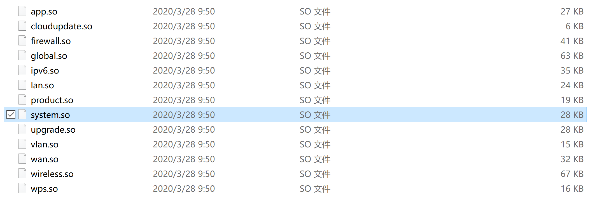
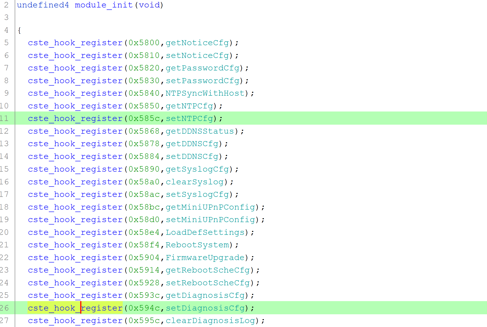
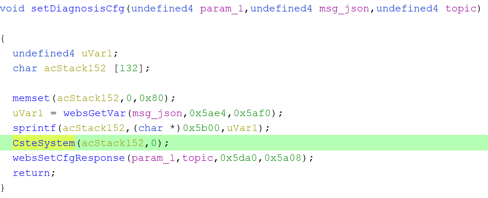
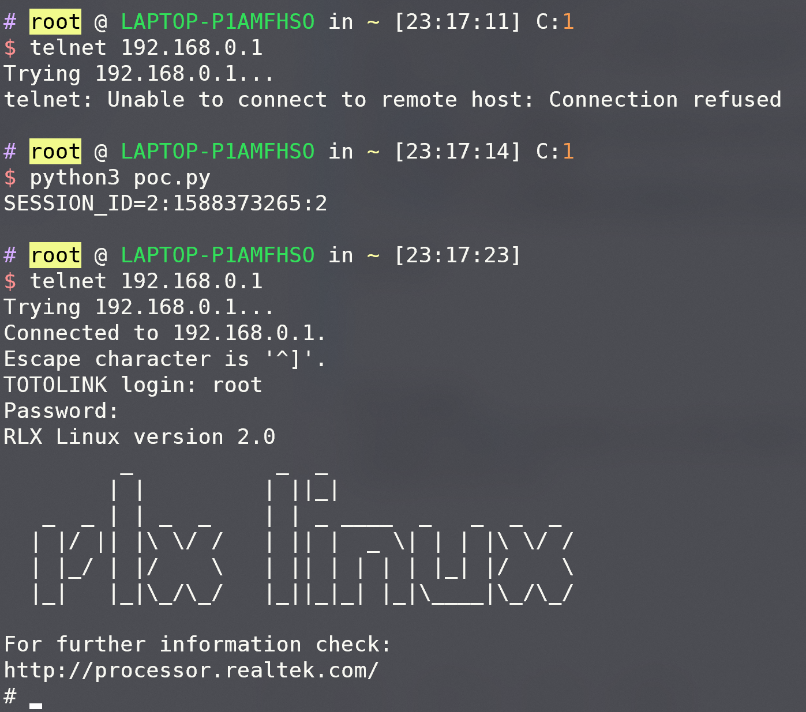

# TOTOLINK Router CMD Injection
There are two cmd injection vulnerabilities in TOTOLINK routers.  
Affected products: including but not limited to [TOTOLINK A950RG](http://totolink.net/home/menu/newstpl/menu_newstpl/products/id/167.html) and [TOTOLINK T10](http://totolink.net/home/menu/newstpl/menu_newstpl/products/id/172.html).  
Affected firmwares: [A950RG V5.9c.4216_B20190710](http://totolink.net/data/upload/20190823/f073768d48ed43bf890c5cb7193e0538.zip) and [T10 V5.9c.4096_B20190509](http://totolink.net/data/upload/20191107/4098b1a2d522b051e3bbf29a051c2122.zip)  
  
  

## Vulnerabilities description
An attacker can execute arbitrary Linux OS commands via "setNTPCfg" and "setDiagnosisCfg" POST requests after login.   
### Modules Load  
/bin/cste_sub: load_modules() function loads all libraries located in directory /lib/cste_modules:  
  
### Handlers Register  
The handlers of "setNTPCfg" and "setDiagnosisCfg" are located in system.so. The module_init() function in system.so registers module handlers:  
  
### Vulnerabilities
In these handlers, there is no filter to avoid insecure characters, functions directly concatenate the imput strings to system commands.  
As an example, handler of setDiagnosisCfg is as follows:  
  

## POC

